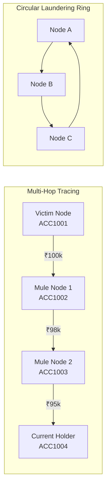

# MoneyTrace AI & Forensic Intelligence Engines Reference

MoneyTrace incorporates multiple specialized AI, Graph Theory, and Machine Learning engines designed to detect financial crime, trace money laundering networks, evaluate asset recovery feasibility, and assist forensic investigators in natural language.

---

## 1. Behavioral Fraud Detection Engine (`fraud_engine.py`)

The Fraud Detection Engine evaluates incoming transactions against **8 deterministic and behavioral scoring rules** in real time.

$$\text{Total Risk Score} = \min\left(100, \sum_{i=1}^{8} w_i \cdot \mathbb{I}(\text{Rule}_i \text{ triggered})\right)$$

### The 8 Core Fraud Rules

| # | Rule Name | Risk Contribution | Trigger Condition | Rationale |
| :-: | :--- | :-: | :--- | :--- |
| **1** | **Large Transaction** | **+30 to +50** | `amount >= ₹50,000` (Scales up to +50 at `₹200,000+`) | Outlier high-value transfer requiring immediate verification. |
| **2** | **Rapid Velocity Transfers** | **+25** | $\ge 3$ outbound transfers within 5 minutes | Automated script or bot executing high-speed fund dissipation. |
| **3** | **New Account High-Value Activity** | **+30** | Account age $< 48\text{ hours}$ and `amount >= ₹25,000` | Fresh mule accounts activated specifically for scam proceeds. |
| **4** | **Balance Drain Anomaly** | **+35** | `transfer_amount >= 90% of total balance` | Account takeover or panic liquidation of compromised accounts. |
| **5** | **Impossible Travel / Geo-Velocity** | **+20** | Locations change across cities within $< 15\text{ minutes}$ | Physical impossibility indicating credential sharing or VPN fraud. |
| **6** | **Device Change Anomaly** | **+15** | New `device_info` fingerprint not in user history | Session hijacking or unauthorized device access. |
| **7** | **Mule Account Forwarding** | **+40** | Account forwards $> 70\%$ of incoming funds within 30 min | Primary hallmark of money laundering layering funnels. |
| **8** | **Failed Inbound Velocity** | **+10** | Multiple failed transfers followed by sudden success | Brute force or credential stuffing attempt. |

---

## 2. Network Flow & Graph Intelligence (`graph_engine.py`)

MoneyTrace constructs an in-memory directed multi-graph $G = (V, E)$ using **NetworkX**:
- **Nodes ($V$)**: Bank accounts ($\text{ACC1001}, \text{ACC1002}, \dots$)
- **Edges ($E$)**: Directed financial transactions ($u \xrightarrow{\text{amount, timestamp, id}} v$)

### Graph Forensic Capabilities

1. **Multi-Hop Money Path Tracing (`/trace/{id}`)**:
   - Traverses outbound paths using Depth-First Search (DFS) with loop prevention.
   - Calculates hop count, intermediate fees deducted by mules, and the **exact current holding account**.
2. **Circular Laundering Cycle Detection (`/suspicious`)**:
   - Executes Tarjan’s Strongly Connected Components algorithm and simple cycle extraction.
   - Flags round-tripping rings ($A \rightarrow B \rightarrow C \rightarrow A$) used for artificial volume inflation or tax evasion.
3. **Mule vs. Collector Hub Detection**:
   - **Mule Nodes**: $\text{In-Degree} \ge 1, \text{Out-Degree} \ge 1, \text{Passthrough Ratio} \ge 70\%$.
   - **Collector Hubs**: $\text{In-Degree} \ge 5, \text{Out-Degree} \le 1$.

---

## 3. Asset Recovery Intelligence Engine (`recovery_engine.py`)

Unlike traditional systems that merely flag alerts, MoneyTrace calculates whether stolen money can be physically preserved and recovered before off-ramping.

### Recovery Scoring Formulation

$$\text{Recovery Score} = \text{Clamp}_{0}^{100}\left(100 - \sum \text{Penalties} + \sum \text{Bonuses}\right)$$

| Factor | Adjustment | Condition |
| :--- | :-: | :--- |
| **Hop Distance** | $-10\text{ pts}$ per hop | Penalty for every intermediary layering hop beyond Hop 1 |
| **Target Node Status** | $-25\text{ pts}$ | Destination account already frozen or in negative status |
| **Fund Splitting** | $-15\text{ pts}$ | Money dispersed across $\ge 2$ downstream beneficiary nodes |
| **Velocity Dissipation** | $-20\text{ pts}$ | Funds moved downstream in $< 10\text{ minutes}$ |
| **Preserved Balance** | $+15\text{ pts}$ | Destination account retains $> 80\%$ of received stolen funds |
| **Circular Ring** | $-30\text{ pts}$ | Transactions are trapped in a high-velocity circular cycle |
| **Time Elapsed** | $-5\text{ pts}$ per 12 hrs | Aging penalty reflecting ATM cash-out risk |

### Recovery Probability Bands & Directives

- **`HIGH` ($\ge 75/100$)**: Immediate intraday debit freeze on current holder account.
- **`MEDIUM` ($40 - 74/100$)**: Requisition Section 91 CrPC notice to beneficiary bank nodal officer.
- **`LOW` ($< 40/100$)**: Funds dissipated or off-ramped. Escalate to cyber cell for crypto / cash-out tracking.

---

## 4. AI Investigator Assistant & Copilot Pro (`ai_assistant.py`)

The AI Copilot operates **100% offline**, requiring zero external cloud dependencies.

### A. RAG Compliance & Policy Knowledge Base
Indexes standard Indian and international banking compliance regulations:
- **RBI Master Direction (`RBI/2021-22/108`)**: Customer protection, zero liability timeline within 3 days, mandatory intraday freeze.
- **PMLA Section 12 & FIU-IND STR**: Mandatory Suspicious Transaction Reporting within 7 days for layering rings.
- **I4C Mule Identification Matrix**: Ministry of Home Affairs criteria for fast-forwarding mules.
- **IBA Fraud SOP**: Inter-bank fraud alert communication protocol.

### B. ML Fraud Pattern Typology Classification
Classifies transactions into 6 financial crime typologies using statistical feature vectors:
1. `Mule Account Activity`
2. `Money Laundering / Layering`
3. `Account Takeover`
4. `UPI / Rapid Phishing Scam`
5. `Investment Scam Funnel`
6. `Identity Theft / Synthetic Account`

### C. Case Similarity Search Engine
Computes multi-dimensional normalized distance against historical precedent cases:

$$\text{Similarity}(C_1, C_2) = 1 - \sqrt{\frac{1}{4}\left( \Delta_{\text{amt}}^2 + \Delta_{\text{risk}}^2 + \Delta_{\text{rec}}^2 + \Delta_{\text{rule}}^2 \right)}$$

### D. Explainable AI (XAI) Feature Importance
Provides mathematical risk attribution weights displayed as visual bar charts in the UI, enabling investigators to see exactly why an alert was triggered.
