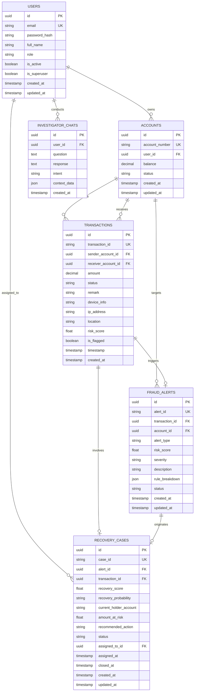

# MoneyTrace Database Schema & Entity-Relationship Architecture

MoneyTrace uses an asynchronous **SQLAlchemy 2.0** ORM layer mapped to **SQLite** (`moneytrace.db`) with support for PostgreSQL in production environments.

---

## 1. Entity-Relationship (ER) Diagram

---

## 2. Table Specifications

### 2.1 `users` Table
Stores authenticated user accounts and RBAC authorization roles.

| Column | Data Type | Constraints | Description |
| :--- | :--- | :--- | :--- |
| `id` | UUID | PRIMARY KEY | Unique user identifier (UUID4) |
| `email` | VARCHAR(255) | UNIQUE, NOT NULL, INDEX | Primary login email |
| `password_hash`| VARCHAR(255) | NOT NULL | Argon2 / PBKDF2 secure password hash |
| `full_name` | VARCHAR(255) | NOT NULL | Investigator / User full name |
| `role` | VARCHAR(50) | NOT NULL, DEFAULT 'CUSTOMER'| Enum: `ADMIN`, `INVESTIGATOR`, `ANALYST`, `CUSTOMER` |
| `is_active` | BOOLEAN | NOT NULL, DEFAULT TRUE | Account activity status |
| `is_superuser` | BOOLEAN | NOT NULL, DEFAULT FALSE | System administrator flag |
| `created_at` | TIMESTAMP | NOT NULL, DEFAULT UTC | Account creation timestamp |
| `updated_at` | TIMESTAMP | NOT NULL, DEFAULT UTC | Last profile update timestamp |

---

### 2.2 `accounts` Table
Bank account ledger storing balances and operating statuses.

| Column | Data Type | Constraints | Description |
| :--- | :--- | :--- | :--- |
| `id` | UUID | PRIMARY KEY | Unique account record ID |
| `account_number` | VARCHAR(64) | UNIQUE, NOT NULL, INDEX | Unique account number (e.g. `ACC1001`) |
| `user_id` | UUID | FOREIGN KEY (`users.id`), NOT NULL | Account owner reference |
| `balance` | DECIMAL(18,2) | NOT NULL, DEFAULT 0.00 | Preserved balance in INR |
| `status` | VARCHAR(32) | NOT NULL, DEFAULT 'ACTIVE' | `ACTIVE`, `FROZEN`, `CLOSED` |
| `created_at` | TIMESTAMP | NOT NULL, DEFAULT UTC | Account opening date |
| `updated_at` | TIMESTAMP | NOT NULL, DEFAULT UTC | Last balance modification date |

---

### 2.3 `transactions` Table
Immutable ledger of financial transfers with behavioral metadata.

| Column | Data Type | Constraints | Description |
| :--- | :--- | :--- | :--- |
| `id` | UUID | PRIMARY KEY | Internal UUID |
| `transaction_id`| VARCHAR(64) | UNIQUE, NOT NULL, INDEX | Business identifier (e.g. `TXN_20260816051148545`) |
| `sender_account_id` | UUID | FOREIGN KEY (`accounts.id`), NOT NULL | Origin account reference |
| `receiver_account_id`| UUID | FOREIGN KEY (`accounts.id`), NOT NULL | Destination account reference |
| `amount` | DECIMAL(18,2) | NOT NULL | Transfer value in INR |
| `status` | VARCHAR(32) | NOT NULL, DEFAULT 'COMPLETED'| `PENDING`, `COMPLETED`, `FAILED`, `FROZEN` |
| `location` | VARCHAR(128) | NULLABLE | Geographic city, country (e.g. `Mumbai, IN`) |
| `device_info` | VARCHAR(255) | NULLABLE | Device fingerprint / model |
| `ip_address` | VARCHAR(64) | NULLABLE | Origin IPv4 / IPv6 address |
| `risk_score` | FLOAT | NOT NULL, DEFAULT 0.0 | Calculated fraud score (0.0 to 100.0) |
| `is_flagged` | BOOLEAN | NOT NULL, DEFAULT FALSE | Immediate fraud triage flag |
| `timestamp` | TIMESTAMP | NOT NULL, DEFAULT UTC, INDEX | Transaction execution timestamp |

---

### 2.4 `fraud_alerts` Table
Alert repository generated by the 8-rule fraud detection engine.

| Column | Data Type | Constraints | Description |
| :--- | :--- | :--- | :--- |
| `id` | UUID | PRIMARY KEY | Internal UUID |
| `alert_id` | VARCHAR(64) | UNIQUE, NOT NULL, INDEX | Case alert identifier (e.g. `ALT20260816051148545`) |
| `transaction_id`| UUID | FOREIGN KEY (`transactions.id`), NULLABLE | Flagged transaction reference |
| `account_id` | UUID | FOREIGN KEY (`accounts.id`), NOT NULL | Subject account reference |
| `alert_type` | VARCHAR(128) | NOT NULL | Triggered rule typology summary |
| `risk_score` | FLOAT | NOT NULL | Composite risk contribution (0.0 to 100.0) |
| `severity` | VARCHAR(32) | NOT NULL, DEFAULT 'HIGH' | `LOW`, `MEDIUM`, `HIGH`, `CRITICAL` |
| `rule_breakdown` | JSON | NULLABLE | JSON breakdown of triggered rules and weights |
| `status` | VARCHAR(32) | NOT NULL, DEFAULT 'OPEN' | `OPEN`, `INVESTIGATING`, `RESOLVED`, `DISMISSED` |
| `created_at` | TIMESTAMP | NOT NULL, DEFAULT UTC | Alert creation timestamp |

---

### 2.5 `recovery_cases` Table
Asset recovery intelligence dossiers for tracking fund reclamation.

| Column | Data Type | Constraints | Description |
| :--- | :--- | :--- | :--- |
| `id` | UUID | PRIMARY KEY | Internal UUID |
| `case_id` | VARCHAR(64) | UNIQUE, NOT NULL, INDEX | Recovery case ID (e.g. `REC202608168920`) |
| `alert_id` | UUID | FOREIGN KEY (`fraud_alerts.id`), NULLABLE | Source alert reference |
| `transaction_id`| UUID | FOREIGN KEY (`transactions.id`), NULLABLE | Stolen transfer reference |
| `recovery_score`| FLOAT | NOT NULL | Recovery score (0.0 to 100.0) |
| `recovery_probability`| VARCHAR(32) | NOT NULL | `LOW`, `MEDIUM`, `HIGH` |
| `current_holder_account`| VARCHAR(64) | NOT NULL | Identified holding node |
| `amount_at_risk`| FLOAT | NOT NULL | Stolen fund amount at risk |
| `recommended_action`| TEXT | NOT NULL | Automated legal / freeze directive |
| `status` | VARCHAR(32) | NOT NULL, DEFAULT 'OPEN' | `OPEN`, `ACTION_TAKEN`, `RECOVERED`, `FAILED` |
| `assigned_to_id`| UUID | FOREIGN KEY (`users.id`), NULLABLE | Assigned SOC investigator |

---

### 2.6 `investigator_chats` Table
Archived conversation and NLU telemetry for MoneyTrace AI Copilot.

| Column | Data Type | Constraints | Description |
| :--- | :--- | :--- | :--- |
| `id` | UUID | PRIMARY KEY | Unique chat interaction ID |
| `user_id` | UUID | FOREIGN KEY (`users.id`), NOT NULL | Asking investigator ID |
| `question` | TEXT | NOT NULL | Natural language question |
| `response` | TEXT | NOT NULL | Formatted markdown forensic response |
| `intent` | VARCHAR(64) | NOT NULL | Classified intent (`EXPLAIN_TRANSACTION`, etc.) |
| `context_data` | JSON | NULLABLE | Contextual entities and metadata |
| `created_at` | TIMESTAMP | NOT NULL, DEFAULT UTC | Message timestamp |
