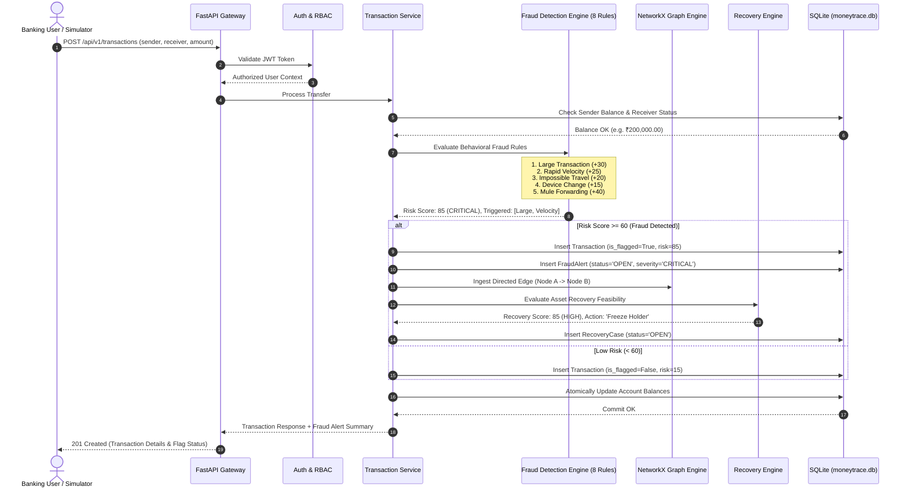
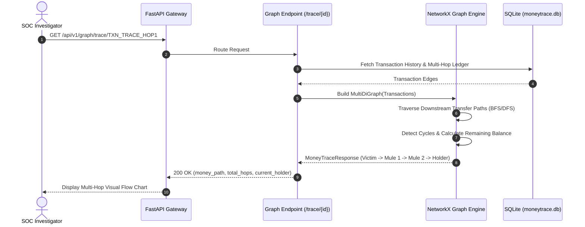
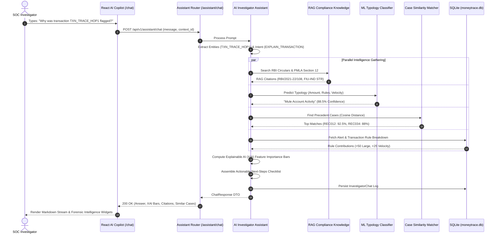
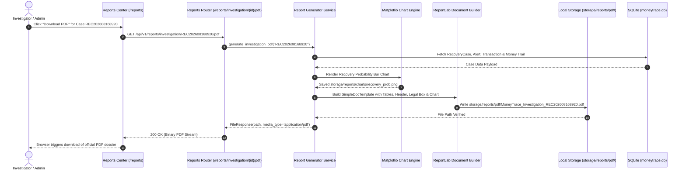

# MoneyTrace End-to-End Data Flow & Sequence Diagrams

This document details the exact sequence of events, data transformations, and state transitions across the MoneyTrace lifecycle.

---

## 1. End-to-End Transaction & Fraud Detection Sequence

---

## 2. Money Flow Graph Traversal & Cycle Detection Sequence

---

## 3. AI Copilot Forensic Intelligence Query Sequence

---

## 4. Multi-Format Report & Export Sequence

