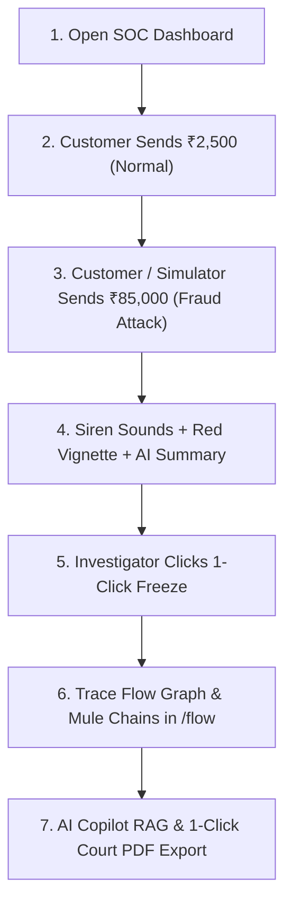

# 🚨 MoneyTrace — Live Interactive Demonstration & Presentation Guide

This guide gives you the **exact, step-by-step presentation script** and operational flow to run a real-time cybersecurity & fraud detection demo for evaluators, professors, recruiters, or 15–20 concurrent students.

---

## 🏗️ 1. Quick Startup & Environment Setup

Run these **2 simple commands** in two separate PowerShell / Terminal windows:

### Terminal 1: Backend API & WebSocket Engine
```powershell
cd f:\codee\MoneyTrace\backend
python -m uvicorn app.main:app --reload --port 8000
```
*(Runs FastAPI backend + WebSocket server at `http://127.0.0.1:8000`)*

### Terminal 2: Frontend Vite Command Center
```powershell
cd f:\codee\MoneyTrace
npm.cmd run dev
```
*(Runs React frontend at `http://localhost:5173`)*

### Terminal 3 (Optional): Automatic Background Live Traffic Generator
```powershell
cd f:\codee\MoneyTrace\backend
python scripts/simulate_live_traffic.py
```
*(Sends a continuous stream of realistic transfers every 3.5 seconds to keep the live ticker and flow graph moving dynamically during presentations)*

---

## 🎭 2. Recommended Screen & Device Setup

To show the real-time interaction:

| Screen / Device | URL | Role | Login Credentials |
| :--- | :--- | :--- | :--- |
| **Main Laptop Screen / Projector** | `http://localhost:5173/` | **SOC Investigator / Admin** | `admin@moneytrace.dev` / `Admin@123456` |
| **Phone 1 / Incognito Tab** | `http://localhost:5173/portal/send` | **Customer 1 (Rahul)** | `rahul@moneytrace.dev` / `Customer@123` |
| **Phone 2 / Student 2** | `http://localhost:5173/portal/home` | **Customer 2 (Sneha)** | `sneha@moneytrace.dev` / `Customer@123` |
| **Phone 3 / Student 3** | `http://localhost:5173/portal/home` | **Customer 3 (Aman)** | `aman@moneytrace.dev` / `Customer@123` |

---

## 🎬 3. The 7-Step Interactive Live Demo Flow



---

### Step 1: Open the SOC Command Center (`/dashboard`)
1. On the main presentation screen, open `http://localhost:5173/`.
2. Login as **`admin@moneytrace.dev`** / **`Admin@123456`**.
3. **What to highlight to the audience**:
   - **Live Feed Ticker**: Top marquee scrolling incoming banking transfers in real-time.
   - **Threat Radar**: Live counters of Critical Alerts, High-Risk Flags, Open Cases, and Mule Nodes.
   - **Active Users Monitor**: Shows 20 online node presence dots (Rahul, Sneha, Aman, Vikram, Priya, etc.).
   - **Live Recovery Tracker**: Displays real-time preserved funds vs. at-risk funds.
   - **Geographic Velocity Heatmap**: Displays high-risk corridors (Mumbai, Delhi, Pune, Bangalore).

> **🗣️ What to Say**:  
> *"MoneyTrace is designed like a real-time Cyber Fraud Security Operations Center (SOC). It constantly listens to multi-node banking telemetry across all connected accounts without page refreshes."*

---

### Step 2: Perform a Normal Customer Transfer (The Baseline)
1. On your phone (or in an Incognito tab), open `http://localhost:5173/portal/send` and log in as **`rahul@moneytrace.dev`** (`Customer@123`).
2. Search recipient: Type **`Sneha`** (select `Sneha Patel - ACC1002`). Notice the green **Online** presence indicator.
3. Enter Amount: **`₹2,500.00`** | Remark: `Dinner bill`.
4. Click **Proceed to Pay** $\rightarrow$ Enter PIN `1234`.
5. **What happens immediately**:
   - **On Phone**: Instant animated green success checkmark + melodic confirmation chime.
   - **On Investigator Screen (Instant 0-Second Reaction)**:
     - Top-right toast notification slides in: `✓ New Transfer: Rahul Sharma sent ₹2,500 to Sneha Patel`.
     - Live Ticker updates with a green dot for `Rahul Sharma → Sneha Patel ₹2,500`.
     - Dashboard balance and volume stats recalculate automatically.

> **🗣️ What to Say**:  
> *"When a legitimate low-risk transfer occurs, MoneyTrace processes it smoothly with low latency and logs telemetry into the audit stream."*

---

### Step 3: Trigger a High-Risk Fraud Attack (The Climax 🚨)
Now demonstrate how MoneyTrace intercepts a major fraud attempt.

**Option A (From Customer Portal)**:
- On Rahul's phone, transfer **`₹85,000`** to **`Aman Verma`** (`ACC1003`) with remark `Urgent crypto clearing`.

**Option B (From Dashboard 1-Click Simulation Dock)**:
- On the Investigator Dashboard, click **`[High Risk Txn]`** or **`[Critical Siren]`** in the **Demo Simulation Control Center**.

**💥 Instant Live Reaction across the System**:
1. **Full-Screen Red Vignette**: A pulsing red glowing emergency border envelops the dashboard.
2. **Audio Siren Alarm**: Dual-oscillator tactical siren begins wailing from the browser Web Audio synthesizer.
3. **Emergency Alert Directive Modal**: Floating high-urgency threat card appears showing:
   - **Amount & Risk**: `₹85,000.00` | **Risk Score: 92/100 (CRITICAL)**.
   - **Triggered Rules**: `✓ Large Transaction`, `✓ Velocity Attack`, `✓ Mule Forwarding`.
   - **AI Copilot Forensic Summary**: *"CRITICAL ANOMALY: Transfer of ₹85,000 from dormant node forwarded to suspected mule ring. Recommended Action: Immediate Debit Freeze."*

> **🗣️ What to Say**:  
> *"The moment an anomaly crosses our risk threshold, the platform activates emergency protocols. Notice the explainable rule engine and the AI Copilot instant forensic summary."*

---

### Step 4: 1-Click Account Freeze (Investigator Command 🔒)
1. On the Emergency Alert Modal, click the red **`[Freeze Account]`** button.
2. **What happens immediately**:
   - Sound switches to an affirmative resolution chime.
   - Alert toast: `🔒 Account ACC1001 was frozen by SOC Investigator`.
   - Account status is locked in the database and across all WebSocket clients.
3. **Show Audience Proof**:
   - Try to send money from Rahul's portal again $\rightarrow$ The portal blocks the transfer with:  
     `"Account is frozen by Bank Compliance / SOC. Outward debits restricted."`

> **🗣️ What to Say**:  
> *"With one click, the investigator can freeze the compromised node before the fraudsters can cash out or off-ramp funds into cryptocurrency."*

---

### Step 5: Visual Forensic Graph Tracing (`/flow`)
1. Click **`[Trace Money Flow]`** on the alert or navigate to **`Flow Visualizer`** (`/flow`).
2. Search for Account **`ACC1001`** or Transaction **`TXN_TRACE_HOP1`**.
3. **What to highlight to the audience**:
   - **Multi-Hop Layering**: View how stolen money traveled through nodes (`ACC1001` $\rightarrow$ `ACC1002` $\rightarrow$ `ACC1003` $\rightarrow$ `ACC1004`).
   - **Dynamic Money Particles**: High-value edges have large, glowing cyan and red particle packets flowing along Bezier curves.
   - **Suspicious Circular Rings**: Switch to **Suspicious Cycles** view to show circular money laundering loops ($A \rightarrow B \rightarrow C \rightarrow A$) detected via NetworkX depth-first cycle search.
   - **Interactive Node Dossier**: Click any account circle to inspect balance, composite risk score, and transaction history.

---

### Step 6: AI Copilot Pro Legal & Regulatory Reasoning (`/chat`)
1. Navigate to **AI Copilot** (`/chat`).
2. Click the suggestion chip:  
   `"Why was transaction TXN_TRACE_HOP1 flagged?"`
3. **What to highlight to the audience**:
   - **Machine Learning Typology**: `Mule Account Activity (88.5% Confidence)`.
   - **XAI Feature Importance**: Visual bar chart explaining why the transaction was flagged.
   - **RAG Legal Citations**: Cites actual legal frameworks:  
     `[RAG-RBI-001]` *RBI Master Direction on Customer Protection* & *PMLA 2002 Section 12*.
   - **Action Checklist**: Auto-generated checkboxes for law enforcement coordination.

---

### Step 7: Asset Recovery & 1-Click Court Report Export (`/recovery` & `/reports`)
1. Navigate to **Asset Recovery** (`/recovery`):
   - Select Case `REC202608168920`.
   - Show the **Recovery Feasibility Score: 85% (HIGH PROBABILITY)**.
   - Show Identified Holding Node: `ACC1004` (funds preserved before withdrawal).
2. Navigate to **Reports & Export** (`/reports`):
   - Under **Investigation Dossier**, click **Download PDF**.
   - Open the generated PDF to show:
     - Official Bank Security Watermark & Header.
     - Section 91 CrPC Legal Notice template.
     - High-resolution Matplotlib recovery probability chart.
     - Forensic transaction audit table.
   - Also demonstrate 1-click **Download Word (.docx)** and **Download Master Excel (.xlsx)**.

---

## 👥 4. Demo Users & Accounts Table (15–20 Users)

All demo accounts are pre-seeded in the database:

| Name | Account Number | Email | Password | Role | Initial Balance |
| :--- | :--- | :--- | :--- | :--- | :--- |
| **Admin / Lead Investigator** | `ACC_ADMIN` | `admin@moneytrace.dev` | `Admin@123456` | ADMIN | ₹500,000.00 |
| **SOC Investigator** | `ACC_INVEST` | `investigator@moneytrace.dev` | `Invest123` | INVESTIGATOR | ₹500,000.00 |
| **Rahul Sharma** | `ACC1001` | `rahul@moneytrace.dev` | `Customer@123` | CUSTOMER | ₹250,000.00 |
| **Sneha Patel** | `ACC1002` | `sneha@moneytrace.dev` | `Customer@123` | CUSTOMER | ₹180,000.00 |
| **Aman Verma** | `ACC1003` | `aman@moneytrace.dev` | `Customer@123` | CUSTOMER | ₹320,000.00 |
| **Priya Nair** | `ACC1004` | `priya@moneytrace.dev` | `Customer@123` | CUSTOMER | ₹140,000.00 |
| **Karan Malhotra** | `ACC1005` | `karan@moneytrace.dev` | `Customer@123` | CUSTOMER | ₹95,000.00 |
| **Vikram Singh** | `ACC1006` | `vikram@moneytrace.dev` | `Customer@123` | CUSTOMER | ₹410,000.00 |
| **Neha Gupta** | `ACC1007` | `neha@moneytrace.dev` | `Customer@123` | CUSTOMER | ₹290,000.00 |
| **Rohit Joshi** | `ACC1008` | `rohit@moneytrace.dev` | `Customer@123` | CUSTOMER | ₹175,000.00 |
| **Anita Desai** | `ACC1009` | `anita@moneytrace.dev` | `Customer@123` | CUSTOMER | ₹220,000.00 |
| **Rajesh Kumar** | `ACC1010` | `rajesh@moneytrace.dev` | `Customer@123` | CUSTOMER | ₹380,000.00 |
| **Suresh Reddy** | `ACC1011` | `suresh@moneytrace.dev` | `Customer@123` | CUSTOMER | ₹195,000.00 |
| **Pooja Shah** | `ACC1012` | `pooja@moneytrace.dev` | `Customer@123` | CUSTOMER | ₹260,000.00 |
| **Sanjay Mehta** | `ACC1013` | `sanjay@moneytrace.dev` | `Customer@123` | CUSTOMER | ₹310,000.00 |
| **Meera Iyer** | `ACC1014` | `meera@moneytrace.dev` | `Customer@123` | CUSTOMER | ₹165,000.00 |
| **Arjun Kapoor** | `ACC1015` | `arjun@moneytrace.dev` | `Customer@123` | CUSTOMER | ₹450,000.00 |
| **Deepa Sharma** | `ACC1016` | `deepa@moneytrace.dev` | `Customer@123` | CUSTOMER | ₹210,000.00 |
| **Aditya Roy** | `ACC1017` | `aditya@moneytrace.dev` | `Customer@123` | CUSTOMER | ₹340,000.00 |
| **Ritu Verma** | `ACC1018` | `ritu@moneytrace.dev` | `Customer@123` | CUSTOMER | ₹185,000.00 |
| **Tanvi Sen** | `ACC1019` | `tanvi@moneytrace.dev` | `Customer@123` | CUSTOMER | ₹275,000.00 |
| **Kunal Bose** | `ACC1020` | `kunal@moneytrace.dev` | `Customer@123` | CUSTOMER | ₹500,000.00 |

---

## 🛠️ 5. Troubleshooting & Maintenance Commands

### Re-seed 20 Named Accounts:
```powershell
cd f:\codee\MoneyTrace\backend
python scripts/seed_demo_accounts.py
```

### Run All Backend Verification Suites:
```powershell
cd f:\codee\MoneyTrace\backend
python scripts/test_endpoints.py
python scripts/test_graph_endpoints.py
python scripts/test_dashboard_endpoints.py
python scripts/test_assistant_endpoints.py
python scripts/test_recovery_endpoints.py
python scripts/test_reports_endpoints.py
```

### Test Frontend Build:
```powershell
cd f:\codee\MoneyTrace
npm.cmd run build
```

---

## 🏆 6. Key Presentation Talking Points (Viva Cheat Sheet)

1. **Full-Stack Reactive Architecture**:
   - Backend built with **FastAPI**, **SQLAlchemy Async**, **SQLite**, and **Centralized WebSocket Event Broadcasting**.
   - Frontend built with **React 18**, **Vite**, **Tailwind CSS**, and **Canvas 2D Particle Engine**.
2. **Explainable AI & Heuristics**:
   - Combines rule-based heuristics (`Large Transaction`, `Velocity Attack`, `Dormant Account Burst`, `Mule Forwarding`) with ML typology classification and RAG legal grounding.
3. **End-to-End Incident Lifecycle**:
   - **Detect** (0s Alert Siren) $\rightarrow$ **Contain** (1-Click Freeze) $\rightarrow$ **Trace** (Graph Visualizer) $\rightarrow$ **Recover** (Asset Feasibility Engine) $\rightarrow$ **Prosecute** (Court Dossier PDF/DOCX Export).
